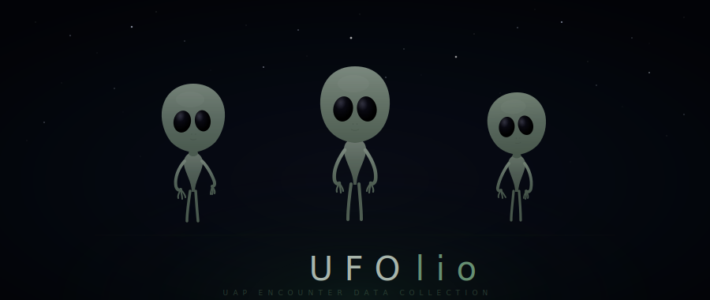

<p align="center">
  
</p>

# UFOlio — UFO/UAP Encounter & Sighting Data Collection

A curated collection of parsed and structured UFO/UAP datasets, spanning sighting reports, entity encounters, contact experiences, and abduction research.

## Datasets

### 1. NUFORC — National UFO Reporting Center (`nuforc/`)

The largest public database of UFO sighting reports, covering over a century of observations.

- **Records:** 80,332 (scrubbed dataset)
- **Date range:** 1949–2014
- **Format:** CSV
- **Fields:** datetime, city, state, country, shape, duration, comments, date posted, latitude, longitude
- **Source:** [Kaggle — NUFORC/ufo-sightings](https://www.kaggle.com/datasets/NUFORC/ufo-sightings)
- **Original:** [nuforc.org](https://nuforc.org/)
- **Analysis scripts:** Shape distribution, geographic concentration, text mining for high-strangeness reports

### 2. Magonia — Vallee's Passport to Magonia Catalog (`magonia/`)

Jacques Vallee's landmark catalog of 923 close encounter and entity cases from 1868–1968, compiled as the appendix to *Passport to Magonia* (1969). Foundational dataset in UFO research.

- **Records:** 923
- **Date range:** 1868–1968
- **Format:** CSV (parsed from JSON)
- **Fields:** source_id, date_raw, date_parsed, time, location, country, description, references
- **Source:** [richgel999/ufo_data (GitHub)](https://github.com/richgel999/ufo_data) — JSON digitization
- **Original book:** Vallee, Jacques. *Passport to Magonia: From Folklore to Flying Saucers.* Henry Regnery Company, 1969.
- **Also available at:**
  - [Archive.org — Passport to Magonia (1993 edition)](https://archive.org/details/PassportToMagonia--UFOsFolkloreAndParallelWorldsJacquesVallee1993)
  - [NICAP — Magonia catalog](https://www.nicap.org/magonia.htm)
  - [UFO Casebook — Magonia complete](https://www.ufocasebook.com/magoniacomplete.html)
- **Top countries:** United States (315), France (201), Brazil (54), Argentina (48), Italy (43)

### 3. Rosales — Albert Rosales Humanoid Encounters Catalog (`rosales/`)

The most comprehensive catalog of humanoid/entity encounter reports ever compiled. Entries include structured metadata: encounter type classification, high strangeness index, and source reliability rating.

- **Records:** 8,666
- **Date range:** ~2300 BC – 2009
- **Format:** CSV (parsed from archived HTML)
- **Fields:** entry_number, year_page, location, date, time, description, hc_number, source, type_code, strangeness_index, reliability, comments
- **Type codes:**
  - A — Entity seen inside or on top of object
  - B — Entity seen entering or exiting object
  - C — Entity seen in vicinity of object
  - D — Entity seen near landing trace or at close range
  - E — Entity seen without related UFO activity
  - F — Trace or physical evidence only
  - G — Direct contact / abduction / interaction
  - H — Alleged crash/forced landing with occupant recovery
  - X — Extreme strangeness
- **Source:** [ufoinfo.com/humanoid/](http://www.ufoinfo.com/humanoid/) (archived via [Wayback Machine](https://web.archive.org/web/2012/http://www.ufoinfo.com/humanoid/))
- **Published books:** Rosales, Albert S. *Humanoid Encounters* series (17 volumes, 1 AD–2015)
- **Note:** 18 year pages (1900, 1940, 1942–1946, 1949, 1957–1958, 1960–1964, 1983–1985) were not available in the Wayback Machine archive. The full catalog reportedly contains 18,000+ entries across all published volumes.

### 4. Mack — John E. Mack Abduction Research (`mack/`)

Case data from Harvard psychiatrist John E. Mack's study of abduction experiencers. Mack conducted in-depth clinical interviews with ~200 subjects through the Program for Extraordinary Experience Research (PEER) at Harvard.

- **Records:** 14 published case studies (from ~200 total subjects)
- **Format:** CSV and JSON (compiled from published book text)
- **Fields:** case_id, pseudonym, chapter, gender, age_at_contact, occupation, location_state, experience_types, entity_description, physical_evidence, key_themes, transformative_effects, source
- **Source book:** Mack, John E. *Abduction: Human Encounters with Aliens.* Charles Scribner's Sons, 1994.
- **Also relevant:** Mack, John E. *Passport to the Cosmos: Human Transformation and Alien Encounters.* Crown, 1999.
- **Full text downloaded from:** [Avalon Library](https://avalonlibrary.net/)
- **Academic paper:** ["The Psychiatrist Who Flew Into Space"](https://meddocsonline.org/) — analysis of Mack's research
- **Note:** Mack's full research archive (~150 boxes, interview recordings, correspondence) is held at [Rice University, Archives of the Impossible](https://archives.rice.edu/) (collection MS 1066). Some materials are restricted until 2074.
- **John E. Mack Institute:** [johnemackinstitute.org](https://johnemackinstitute.org/)
- **Demographics:** 8 male / 6 female subjects published, ages 22–55 (mean ~34)

### 5. FREE — Foundation for Research into Extraterrestrial & Extraordinary Encounters (`free/`)

The world's first comprehensive academic survey of UAP contact experiencers, co-founded by Apollo 14 astronaut Dr. Edgar Mitchell, Harvard astrophysicist Dr. Rudy Schild, and researcher Rey Hernandez. This is the only large-scale dataset focused on consciousness, telepathy, and psi phenomena in the context of UAP contact.

- **Respondents:** 4,350+ across 3 survey phases
- **Phase 1:** 3,256 respondents, 150 questions
- **Phase 2:** 1,919 respondents, 401 questions (551 total across phases)
- **Phase 3:** 70+ open-ended qualitative questions
- **Countries:** 100+
- **Format:** CSV and JSON (aggregate findings extracted from published chapter PDFs)
- **Fields:** category, finding, value, unit
- **Source chapters downloaded from:** [agreaterreality.com](https://agreaterreality.com/) — all volumes available as free PDFs:
  - [Hernandez, Klimo & Schild — UFO Report (Phase I & II quantitative results)](https://agreaterreality.com/downloads/articles/Hernandez,%20Klimo,%20Shild%20-%20UFO%20Report.pdf)
  - [Valverde & Swanson — Data Mining](https://agreaterreality.com/downloads/articles/Valverde%20%26%20Swanson%20-%20Data%20Mining.pdf)
  - [Brad Steiger — The FREE Experiencer Research Study](https://agreaterreality.com/downloads/articles/Brad%20Steiger%20-%20The%20FREE%20Experiencer%20Research%20Study.pdf)
  - [Emmons — Methodologies for the Mysterious](https://agreaterreality.com/downloads/articles/Emmons%20-%20Methodologies%20for%20the%20Mysterious.pdf)
  - [Greyson — NDEs](https://agreaterreality.com/downloads/articles/Greyson%20-%20NDEs.pdf)
  - [Julia Sellers — OBEs](https://agreaterreality.com/downloads/articles/Julia%20Sellers%20-%20OBEs.pdf)
  - [Grosso — Contact With Transcendent Mind](https://agreaterreality.com/downloads/articles/Grosso%20-%20Contact%20With%20Transcendent%20Mind.pdf)
  - [Rodwell — Awakening to a Greater Reality](https://agreaterreality.com/downloads/articles/Rodwell%20-%20Awakening%20to%20a%20Greater%20Reality.pdf)
  - [Burkes — Report from the Contact Underground](https://agreaterreality.com/downloads/articles/Burkes%20-%20Report%20from%20the%20Contact%20Underground.pdf)
  - [Hernandez — The Mind of GOD](https://agreaterreality.com/downloads/articles/Hernandez%20-%20The%20Mind%20of%20GOD.pdf)
  - [Full article index at agreaterreality.com](https://agreaterreality.com/)
- **Also available (Phase 2 raw question responses):** [SlideShare — Complete Phase 2, Questions 1-257](https://www.slideshare.net/Experiencer/complete-phase-2-questions-1257-anonymous-free-survey-results)
- **Published in:** *Beyond UFOs: The Science of Consciousness & Contact with Non Human Intelligence.* 2018. ([Amazon](https://www.amazon.com/Beyond-UFOs-Science-Consciousness-Intelligence/dp/1721088652))
- **Follow-up publication:** *A Greater Reality.* 2021. ([agreaterreality.com](https://agreaterreality.com/))
- **Successor organization:** [CCRI — Consciousness and Contact Research Institute](https://consciousnessandcontact.org/)
- **Telepathy data deep-dive:** [Contact Underground — Parameters of Telepathic Communication](https://contactunderground.org/2024/10/04/what-are-the-parameters-of-telepathic-communication-with-nhis-associated-with-uap/)
- **Headline findings:**
  - 78% received telepathic communication from NHI
  - 80% had Out of Body Experiences
  - 85% said the experience changed their life positively
  - 50% reported medical healing
  - 36% had Near Death Experiences
  - 84% do NOT want contact to stop
- **Note:** Raw survey microdata (individual responses) has not been publicly released. What we have are the aggregate statistical findings extracted from the published research chapters. 10 chapter PDFs downloaded covering the core survey results, data mining analysis, NDEs, OBEs, contact reports, and methodological discussion.

## Directory Structure

```
ufolio/
├── README.md                  ← this file
├── nuforc/
│   ├── data/
│   │   ├── scrubbed.csv
│   │   └── complete.csv
│   ├── charts/                ← generated analysis charts (PNG)
│   ├── ufo_shape_analysis.py
│   ├── egg_pnw_analysis.py
│   ├── egg_text_mining.py
│   └── high_strangeness_mining.py
├── magonia/
│   ├── data/
│   │   ├── magonia_raw.json
│   │   └── magonia_parsed.csv
│   └── parse_magonia.py
├── rosales/
│   ├── data/
│   │   ├── raw/               ← cached HTML from Wayback Machine
│   │   └── rosales_parsed.csv
│   └── scrape_rosales.py
├── mack/
│   ├── data/
│   │   ├── mack_case_studies.csv
│   │   ├── mack_case_studies.json
│   │   ├── mack_research_metadata.json
│   │   ├── mack_demographics_summary.json
│   │   └── Mack_Abduction_text.txt
│   └── compile_mack.py
└── free/
    ├── data/
    │   ├── free_survey_findings.csv
    │   ├── free_survey_findings.json
    │   ├── free_report_percentages.json
    │   ├── free_regex_findings.json
    │   └── articles/           ← 10 chapter PDFs + extracted text
    └── parse_free_data.py
```

## Additional Data Sources (not yet incorporated)

| Source | Description | Access |
|--------|-------------|--------|
| [MUFON CMS](https://www.mufon.com/) | 100,000+ cases with CE classification | Membership / researcher access |
| [CUFOS / UFOCAT](https://cufos.org/) | 100,000+ entries with Hynek classification, strangeness and credibility ratings | Organization dormant; archives in limbo |
| [GEIPAN](https://www.geipan.fr/) | French government UAP investigation, ~2,700 cases | Browsable online |
| [INTCAT (Peter Rogerson)](http://intcat.blogspot.com/) | Extension of Vallee's Magonia catalog to 5,000+ entries (1750–1999) | Blog format |
| [timothyrenner/nuforc_sightings_data](https://github.com/timothyrenner/nuforc_sightings_data) | Regularly updated NUFORC scrape, ~140K records | GitHub |
| [Rice University — Archives of the Impossible](https://archives.rice.edu/) | Mack's full archive, Jacques Vallee's papers, other UAP research collections | Physical archive, some restrictions |

## Data Availability & Limitations

### What we have

| Dataset | Records | Coverage | Last Updated | Completeness |
|---------|---------|----------|--------------|--------------|
| NUFORC | 80,332 | 1949–2014 | Kaggle snapshot circa 2014 | ~95% (some missing locations/times) |
| Magonia | 923 | 1868–1968 | Complete (finite historical catalog) | 100% of Vallee's published appendix |
| Rosales | 8,666 | ~2300 BC–2009 | Wayback Machine snapshots from 2006–2012 | ~48% of full catalog (18,000+ entries in published books) |
| Mack | 14 | 1990s | Complete (finite published cases) | 7% of Mack's ~200 subjects |
| FREE | 45 findings | 2013–2018 | Published chapters (2018/2021) | Aggregate statistics only — no individual response data |

### Key gaps

- **NUFORC ends around 2014.** The Kaggle dataset is a static snapshot. NUFORC continues to collect reports at [nuforc.org](https://nuforc.org/). A more recent scrape (~140K records through ~2020) is available at [timothyrenner/nuforc_sightings_data](https://github.com/timothyrenner/nuforc_sightings_data) on GitHub.
- **Rosales is missing ~52% of entries.** 18 year pages were unavailable in the Wayback Machine (1900, 1940, 1942–1946, 1949, 1957–1958, 1960–1964, 1983–1985). The full 18,000+ entry catalog exists across Rosales' 17 published book volumes but has not been digitized. The [Humanoid Encounters Project](https://6degreesofjohnkeel.com/blog/announcing-the-humanoid-encounters-project) reportedly received the full dataset from Rosales and plans to make it publicly accessible — status unknown.
- **Mack's raw data is locked away.** Only 14 of ~200 case studies were published. The full archive (~150 boxes of interviews, recordings, correspondence) is held at [Rice University — Archives of the Impossible](https://archives.rice.edu/) (collection MS 1066). The collection is unprocessed and not digitized. Some materials are **restricted until 2074**.
- **FREE survey has no raw microdata.** We have the aggregate statistics (45 structured findings) extracted from the published research chapters, but individual-level response data for the 4,350 respondents has never been released. The full chapter PDFs are available free at [agreaterreality.com](https://agreaterreality.com/). Contact Rey Hernandez / CCRI for research access to raw data.
- **MUFON's 100,000+ case database** requires membership or researcher access and is not freely downloadable.
- **CUFOS/UFOCAT** (~100,000 entries with Hynek classification and strangeness/credibility ratings) is in limbo — the organization is largely dormant.

### What could be added

| Source | Effort | Value |
|--------|--------|-------|
| Updated NUFORC scrape (GitHub, ~140K records) | Low — CSV download | Adds 6+ more years of sighting data |
| GEIPAN French government cases (~2,700) | Medium — web scraping | International data with official CE classification |
| INTCAT (Peter Rogerson's Magonia extension, 5,000+ entries) | High — blog scraping + parsing | Triples the Magonia-style entity catalog |
| Rosales published books (17 volumes) | High — OCR + parsing | Doubles the humanoid encounter catalog |
| FREE survey aggregate data | Manual — from published books | Consciousness/contact statistics |

## License & Attribution

This repository aggregates publicly available data for research purposes. Each dataset retains its original licensing and attribution:

- **NUFORC:** Public domain sighting reports via [nuforc.org](https://nuforc.org/)
- **Magonia:** Digitized from Vallee's published work; JSON source by [richgel999](https://github.com/richgel999/ufo_data)
- **Rosales:** Compiled by Albert S. Rosales; archived web pages via Wayback Machine
- **Mack:** Case studies from published academic/clinical research by John E. Mack, M.D.
